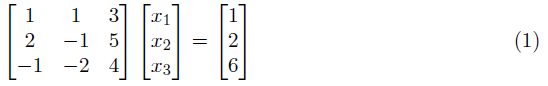

# Problem Set 1

You can think of vectors representing many dimensions of related information. For instance, Netflix might store all the ratings a user gives to movies in a vector. This is clearly a vector of very large dimensions (in the millions) and very sparse as the user might have rated only a few movies. Similarly, Amazon might store the items purchased by a user in a vector, with each slot or dimension representing a unique product and the value of the slot, the number of such items the user bought. One task that is frequently done in these settings is to nd similarities between users. And, we can use dot-product between vectors to do just that. As you know, the dot-product is proportional to the length of two vectors and to the angle between them. In fact, the dot-product between two vectors, normalized by their lengths is called as the cosine distance and is frequently used in recommendation engines.

(1) Calculate the dot product u:v where u = [0.5; 0.5] and v = [3; -4]
(2) What are the lengths of u and v? Please note that the mathematical notion of the length of a vector is not the same as a computer science definition.
(3) What is the linear combination: 3u - 2v?
(4) What is the angle between u and v

You can use R-markdown to submit your responses to this problem set. If you decide to do it in paper, then please either scan it or take a picture using a smartphone and attach that picture. Please make sure that the picture is legible before submitting.
  
## Question 1: 

Calculate the dot product u:v where u = [0.5;0.5] and v= [3;-4]

**Answer**: Dot product u:v = -0.5

```{r, eval=TRUE}

# We can convert the matrix and then do the dot product
u <- matrix(c(0.5,0.5), ncol=2)
v <- matrix(c(3,-4), ncol=2)

dot_prod_1 <- u %*% t(v)
dot_prod_1

# Or we can directly multiply both vectors
u <- c(0.5,0.5)
v <- c(3,-4)

dot_prod_2 <- u %*% v
dot_prod_2
       
```

## Question 2:

What are the lengths of u and v? Please note that the mathematical notion of the length of a vector is not the same as a computer science definition.

**Answer**: Length of u is 0.7071068. Length of v is 5.

```{r, eval=TRUE}

# Length of u
length_u <- sqrt(0.5^2 + 0.5^2)
length_u

# Length of v
length_v <- sqrt(3^2 + (-4)^2)
length_v

```

## Question 3:

What is the linear combination: 3u-2v?

**Answer**: Linear combination fo 3u-2v = [-4.5; 9.5]

```{r, eval=TRUE}

# Define u and v vectors
u <- c(0.5, 0.5)
v <- c(3, -4)

# Linear combination
linear_comb <-  3*u - 2*v
linear_comb

```

## Question 4:

What is the angle between u and v

**Answer**:  The angle between u and v vectors is 1.712693 (radians) or 98.1301 degrees).

```{r, eval=TRUE}

# Angle in radians
angle_uv_rad <- acos(dot_prod_1/(length_u * length_v))
angle_uv_rad

# Convert radians to degrees
angle_uv_deg <- angle_uv_rad * 180 / pi
angle_uv_deg

```


# Problem Set 2

Set up a system of equations with 3 variables and 3 constraints and solve for x. Please write a function in R that will take two variables (matrix A & constraint vector b) and solve using elimination. Your function should produce the right answer for the system of equations for any 3-variable, 3-equation system. You don't have to worry about degenerate cases and can safely assume that the function will only be tested with a system of equations that has a solution. Please note that you do have to worry about zero pivots, though. Please note that you should not use the built-in function solve to solve this system or use matrix inverses. The approach that you should employ is to construct an Upper Triangular Matrix and then back-substitute to get the solution. Alternatively, you can augment the matrix A with vector b and jointly apply the Gauss Jordan elimination procedure.

Please test it with the system below and it should produce a solution x = [-1.55; -0.32; 0.95]

[](https://github.com/SieSiongWong/DATA-605/blob/master)

## Function

Below function is using the Gaussian elimination procedure to convert the coefficient matrix A into the Upper Triangular Matrix (Row Echelon Form) and then back-substitute variables to get the solution for any 3-variable, 3-equation system.

```{r, eval=TRUE}

# Function to solve for any 3-variable, 3-equation system
linear_system_soln <- function(A, b){
  
# Number rows of matrix A
row_mtrx_A <- nrow(A)

# Combine matrix A and constraint vector b
gaussian_soln <- cbind(A, b)

# Start with transforming the 1st row leftmost nonzero entry to 1
gaussian_soln[1,] <- gaussian_soln[1,] / gaussian_soln[1,1]

# Using while loop to continue row operations

i <- 2 # Initialize with row 2

while (i < row_mtrx_A + 1) {
  
 # Transform the nonzero leading entries on rows to zero
 j <- i
  
 while (j < row_mtrx_A + 1) {
   
  gaussian_soln[j,] <- gaussian_soln[j,] - gaussian_soln[i-1,] * gaussian_soln[j,i-1]
  
  j <- j + 1
  
 }
 
 # Swap the 2nd row and 3rd row if the entry at the 2nd row and 2nd column position is zero
 while (gaussian_soln[i,i] == 0) {
   
  gaussian_soln <- rbind(gaussian_soln[-i,], gaussian_soln[i,])
  
 }
 
# Transform the 1st nonzero entry on rows to 1
gaussian_soln[i,] <- gaussian_soln[i,] / gaussian_soln[i,i]
 
i <- i + 1

}

# Back-substitute to get the final solution
x3 <- gaussian_soln[3,4] / gaussian_soln[3,3]

x2 <- (gaussian_soln[2,4] - gaussian_soln[2,3] * x3) / gaussian_soln[2,2]

x1 <- (gaussian_soln[1,4] - gaussian_soln[1,2] * x2 - gaussian_soln[1,3] * x3) /
      gaussian_soln[1,1]

# Convert the result to vector
result <- as.vector(round(c(x1,x2,x3), digits=2))

return(result)
 
}

```

## Testing

```{r, eval=TRUE}

# System example for testing the function
A <- matrix(c(1,1,3,2,-1,5,-1,-2,4), byrow=T, nrow=3, ncol=3)
b <- matrix(c(1,2,6), nrow=3, ncol=1)

linear_system_soln(A, b)

```
