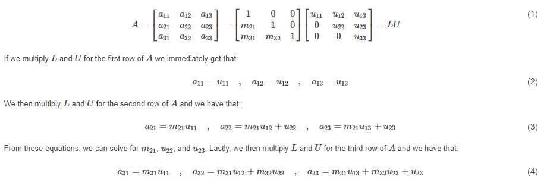
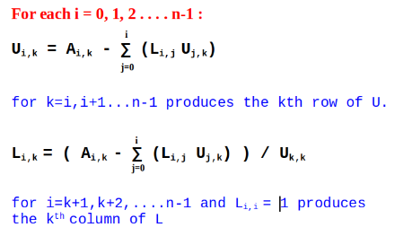

# Problem Set 1

(1) Show that ${ A }^{ T }A\neq A{ A }^{ T }$ in general. (Proof and demonstration.)
(2) For a special type of square matrix A, we get AT A = AAT . Under what conditions could this be true? (Hint: The Identity matrix I is an example of such a matrix).

## Question 1: 

Show that ${ A }^{ T }A\neq A{ A }^{ T }$ in general. (Proof and demonstration.)

**Answer**: The product of ${ A }^{ T }A$ is not equal to $A{ A }^{ T }$ in general because the multiplication elements in rows and columns between ${ A }^{ T }A$ and $A{ A }^{ T }$ are different. Therefore, their product matrix will be different.

To proof above explanation:

Let $A\quad =\quad \begin{bmatrix} { x }_{ 1 } & { x }_{ 2 } \\ { y }_{ 1 } & { y }_{ 2 } \end{bmatrix}$

and the transpose of matrix **A** will be ${ A }^{ T }\quad =\quad \begin{bmatrix} { x }_{ 1 } & { y }_{ 1 } \\ { x }_{ 2 } & { y }_{ 2 } \end{bmatrix}$

So,
 
${ A }^{ T }A\quad =\quad \begin{bmatrix} { x }_{ 1 }{ x }_{ 1 }\quad +\quad { y }_{ 1 }{ y }_{ 1 } & { x }_{ 1 }{ x }_{ 2 }\quad +{ \quad y }_{ 1 }{ y }_{ 2 } \\ { { x }_{ 2 }x }_{ 1 }\quad +\quad { y }_{ 2 }{ y }_{ 1 } & { x }_{ 2 }{ x }_{ 2 }\quad +{ \quad y }_{ 2 }{ y }_{ 2 } \end{bmatrix}$

and 

${ AA }^{ T }\quad =\quad \begin{bmatrix} { x }_{ 1 }{ x }_{ 1 }\quad +\quad x_{ 2 }{ x }_{ 2 } & { x }_{ 1 }{ y }_{ 1 }\quad +\quad x_{ 2 }{ y }_{ 2 } \\ { { y }_{ 1 }x }_{ 1 }\quad +\quad { y }_{ 2 }x_{ 2 } & { y }_{ 1 }{ y }_{ 1 }\quad +{ \quad y }_{ 2 }{ y }_{ 2 } \end{bmatrix}$

You can see that the product of the first element in ${ A }^{ T }A$ and $A{ A }^{ T }$ are not equal, ${ x }_{ 1 }{ x }_{ 1 }\ +\ { y }_{ 1 }{ y }_{ 1 } \neq { x }_{ 1 }{ x }_{ 1 }\ +\ x_{ 2 }{ x }_{ 2 }$

The above proof is for the 2x2 square matrix. This happens the same even for non-square matrices. For instance, the dimension of matrix **A** is 3 x 2 and the dimension of transpose of matrix **A** is 2 x 3. The product of $A{ A }^{ T }$ which dimension is 3 x 3 while the dimension of the product of ${ A }^{ T }A$ is 2 x 2. It's clear that ${ A }^{ T }A\neq A{ A }^{ T }$ because the dimension of matrix product for both sides are not the same.

Example of a square matrix:

From the below demonstration, we can see that the product of $A{ A }^{ T }$ and ${ A }^{ T }A$ are not the equal.

```{r, eval=TRUE}

# Create a 3x3 square matrix
mtrx_a <- matrix(c(1,1,3,2,-1,5,-1,-2,4), byrow=T, nrow=3, ncol=3)
mtrx_a

# Transpose of matrix A
mtrx_a_trans <- t(mtrx_a)
mtrx_a_trans

# Product of matrix A with transpose of matrix A
mtrx_aat <- mtrx_a %*% mtrx_a_trans
mtrx_aat

# Product of transpose of matrix A with matrix A
mtrx_ata <- mtrx_a_trans %*% mtrx_a
mtrx_ata

# Checking if AAT not equal to ATA
(mtrx_aat == mtrx_ata)

```

Example of a non-square matrix:

From the below demonstration, we can see that the product of $A{ A }^{ T }$ and ${ A }^{ T }A$ are not the equal.

```{r, eval=TRUE}

# Create a 3x3 square matrix
mtrx_a2 <- matrix(c(1,2,2,6,1,0,1,3,1,0,1,1), byrow=T, nrow=3, ncol=4)
mtrx_a2

# Transpose of matrix A
mtrx_a2_trans <- t(mtrx_a2)
mtrx_a2_trans

# Product of matrix A with transpose of matrix A
mtrx_aat2 <- mtrx_a2 %*% mtrx_a2_trans
mtrx_aat2

# Product of transpose of matrix A with matrix A
mtrx_ata2 <- mtrx_a2_trans %*% mtrx_a2
mtrx_ata2

# Checking if AAT not equal to ATA by (mtrx_aat2 == mtrx_ata2) will be getting the non-conformable arrays error as the dimension of matrix at both sides of that equation are not the same.

```

## Question 2:

For a special type of square matrix A, we get ${ A }^{ T }A=A{ A }^{ T }$ . Under what conditions could this be true? (Hint: The Identity matrix I is an example of such a matrix).

**Answer**: ${ A }^{ T }A=A{ A }^{ T }$ could be true when ${ A }^{ T }$ is inverse of **A** and the product result of either ${ A }^{ T }A$ or $A{ A }^{ T }$ will be equal to an identity matrix. That is if ${ A }^{ -1 }={ A }^{ T }$ then ${ A }^{ T }A=A{ A }^{ T }=I$. This means that each column vector has length one and is perpendicular to all the other column vectors. That means it is an orthonormal matrix.

To prove,

${ A }^{ T }A=I\\ { AA }^{ T }A=AI\\ { AA }^{ T }A{ A }^{ -1 }=AI{ A }^{ -1 }\\$

Multiplying a matrix by the identity matrix doesn't change anything and multiplying a matrix with its inverse matrix equal to identity matrix. So,

${ AA }^{ T }I=A{ A }^{ -1 }\\ A{ A }^{ T }=I$


# Problem Set 2

Matrix factorization is a very important problem. There are supercomputers built just to do matrix factorizations. Every second you are on an airplane, matrices are being factorized. Radars that track fights use a technique called Kalman filtering. At the heart of Kalman Filtering is a Matrix Factorization operation. Kalman Filters are solving linear systems of equations when they track your flight using radars. 

Write an R function to factorize a square matrix A into LU or LDU, whichever you prefer. Please submit your response in an R Markdown document using our class naming convention, E.g. LFulton_Assignment2_PS2.png

You don't have to worry about permuting rows of A and you can assume that A is less than 5x5, if you need to hard-code any variables in your code. If you doing the entire assignment in R, then please submit only one markdown document for both the problems.


**Answer**: Function below to decompose a square matrix into lower and upper triangular matrix.

## Function

Applying the Doolittle's method to build a function to factor a square matrix into an LU decomposition. Refer to the algorithms from https://www.geeksforgeeks.org/doolittle-algorithm-lu-decomposition/.

[](https://github.com/SieSiongWong/DATA-605/blob/master)

These equations can be summarized into ${ L }_{ i,k }$ and ${ U }_{ i,k }$ as below.

[](https://github.com/SieSiongWong/DATA-605/blob/master)

We then can build a factorization function to decompose a square matrix into an L and U based on these equations.

```{r, eval=TRUE}

factorize <- function(mtx,n){
  
  # Create empty matrix for lower and upper triangular matrix 
  lower <- matrix(0, nrow=n, ncol=n)
  upper <- matrix(0, nrow=n, ncol=n)
  
  # Decomposing matrix into upper and lower triangular matrix using loop
  for (i in 1:n){
    
    # Upper triangular
    for (k in i:n){
      
      # Summation of L[i, j] * U[j, k]
      sum <- 0
      for (j in 1:i){
        sum <- sum + (lower[i,j] * upper[j,k])
      }
      
      # Evaluating U[i, k] 
      upper[i,k] <- mtx[i,k] - sum
      
    }
  
    # Lower Triangular
    for (k in i:n){
      
      if (i==k){
        lower[i,i] <- 1 # Diagonal as 1
      } else{
        
            # Summation of L[k, j] * U[j, i]
            sum <- 0
            for (j in 1:i){
              sum <- sum + (lower[k,j] * upper[j,i])
            }
            
            # Evaluating L[k, i]
            lower[k,i] = (mtx[k,i] - sum) / upper[i,i]
      }
    }
  }
  
  list <- list("U"=upper, "L"=lower)
  return(list)

}

```

## Testing

Testing with 3x3 Square Matrix

```{r, eval=TRUE}

# 3x3 square matrix for testing the function
mtx <- matrix(c(2,-1,-2,-4,6,3,-4,-2,8), byrow=T, nrow=3, ncol=3)

factorize(mtx,3)

# Checking if LU = mtx
(factorize(mtx,3)$L %*% factorize(mtx,3)$U == mtx)

```

Testing with 4x4 Square Matrix

```{r, eval=TRUE}

# 4x4 square matrix for testing the function
mtx <- matrix(c(1,-2,-2,-3,3,-9,0,-9,-1,2,4,7,-3,-6,26,2), byrow=T, nrow=4, ncol=4)

factorize(mtx,4)

# Checking if LU = mtx
(factorize(mtx,4)$L %*% factorize(mtx,4)$U == mtx)

```

Testing with 5x5 Square Matrix

```{r, eval=TRUE}

# 5x5 square matrix for testing the function
mtx <- matrix(
              c(4,1,2,-3,5,-3,3,-1,4,-2,-1,2,5,1,3,5,4,3,-1,2,1,-2,3,-4,5,-16,20,-4,-10,3), 
              byrow=T, 
              nrow=5, 
              ncol=5)

factorize(mtx,5)

# Checking if LU = mtx
(factorize(mtx,5)$L %*% factorize(mtx,5)$U == mtx)

```
